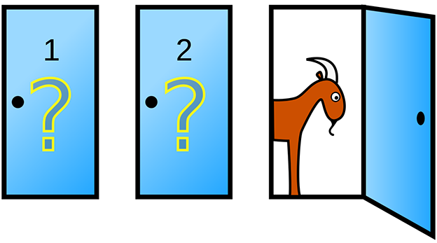

# The Monty Hall Problem

The Monty Hall problem is based on an American television game show and named after its host, Monty Hall. The problem goes like this:

Suppose you're on a game show, and you're given the choice of three doors. Behind one door is a car; behind the others, goats. 

You pick a door, say number one. Then the host, who knows what's behind the doors, opens another door, say nuymber three, which reveals a goat. 

The host then says to you, "Do you want to keep your original foor, or switch to door number two?"

Is it to your advantage to switch your choice?

This repo will use JavaScript to prove the Monty Hall problem.

***

## Repo Resources

* [Visual Studio Code](https://code.visualstudio.com/) or [Brackets](http://brackets.io/) (or any code editor)
* [The Monty Hall Problem](https://www.youtube.com/watch?v=4Lb-6rxZxx0)

